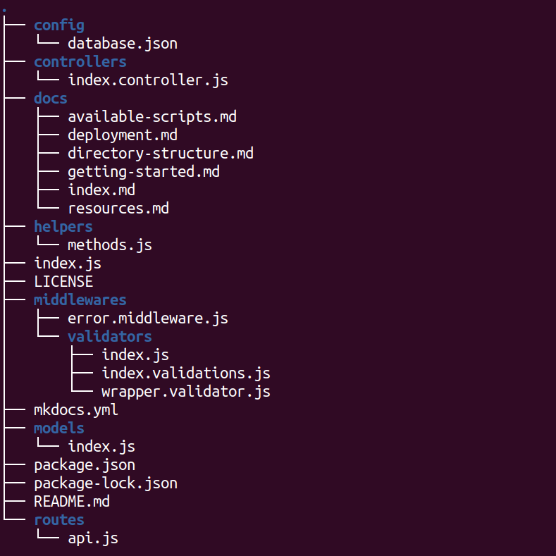

# Directory Structure

After creation, your project should look like this:

**index.js** is the JavaScript entry point.

You can delete or rename the other files.

You can, however, create more top-level directories as the system provide you with a full free hand.
